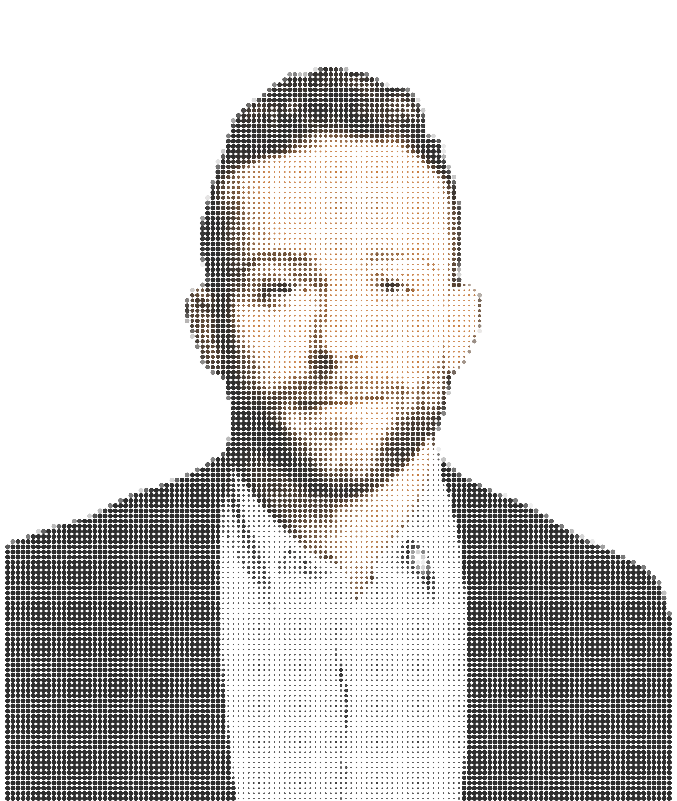

My research focuses on assessing whether AI systems might meaningfully lower the barriers to weaponizing biology. My motivation is to reduce the risk of it happening.

I began this as a [Pivotal Research](https://www.pivotal-research.org/) Fellow, with mentorship from [SecureBio](https://securebio.org/). My first project looked at adversarial elicitation in [Inspect AI](https://inspect.aisi.org.uk/): how do you take a query a model has refused and still get it to answer? I suspect chemical and biological risk needs to adopt the concept of attacker intuition from our colleagues in cyber.

Before this I was an mRNA scientist, doing wet-lab R&D. I hold an MSc in Medical Science from Boston University (2023) and a BSc in Biochemistry from UMass Amherst (2020).

The best way to understand how I think is to read my writing — here, or on my [Substack](https://austinpatrick.substack.com).

## Find me

- **Writing (canonical):** [Essays on this site](/writing/)
- **Writing (Substack):** [Rational Biology](https://austinpatrick.substack.com) — published as Austin Patrick (middle name)
- **Code:** [GitHub: gvmfhy](https://github.com/gvmfhy)
- **Professional:** [LinkedIn](https://www.linkedin.com/in/austin-p-morrissey/)
- **Academic:** [Google Scholar](https://scholar.google.com/citations?user=uMwJNXEAAAAJ&hl=en) · [ORCID 0009-0007-8578-2687](https://orcid.org/0009-0007-8578-2687)
- **Email:** austinpatrickmorrissey \[at\] gmail \[dot\] com

::: {.callout-note appearance="simple"}
**About this site.** Built with [Quarto](https://quarto.org); source on [GitHub](https://github.com/gvmfhy).
:::
