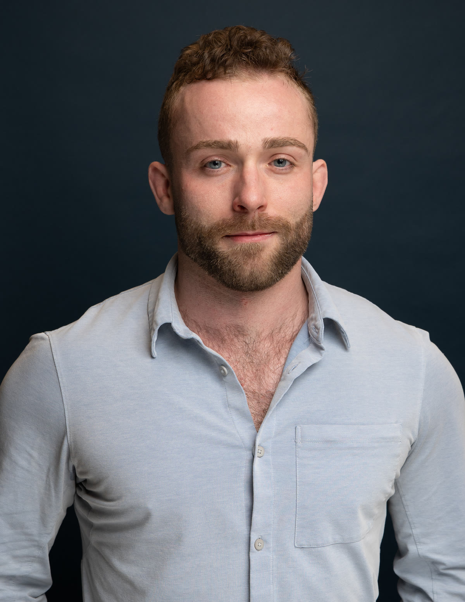

My research focuses on assessing whether AI systems might meaningfully lower the barriers to weaponizing biology. My motivation is to reduce the risk of it happening.

I began this work at [Pivotal Research](https://www.pivotal-research.org/) as a research fellow mentored by [SecureBio](https://securebio.org/). My first project focused on automating the measurement of refusal robustness across providers, using internal evaluations meant to measure chemical and biological risk, like the [Virology Capabilities Test](https://securebio.org/virologytest/). Put another way, when a model won’t answer a hazardous question, how do you get around it?

Currently, I mentor [a SPAR project on AI-enabled cyber-bio offense](https://sparai.org/projects/f26/recqZphVpCRiFlAxK/?tab=biosecurity), examining how these overlapping threat vectors could create novel pathways for severe harm. On occasion, I facilitate the [AGI Strategy course at BlueDot](https://bluedot.org/courses/agi-strategy). Before this I was an mRNA scientist, doing wet-lab R&D. I hold an MSc in Medical Science from Boston University and a BSc in Biochemistry and Molecular Biology from UMass Amherst.

The best way to understand how I think is to read my writing — here, or on my [Substack](https://austinpatrick.substack.com).

## Find me

- **Professional:** [LinkedIn](https://www.linkedin.com/in/austin-p-morrissey/)
- **Academic:** [Google Scholar](https://scholar.google.com/citations?user=uMwJNXEAAAAJ&hl=en) · [ORCID 0009-0007-8578-2687](https://orcid.org/0009-0007-8578-2687)
- **Code:** [GitHub: gvmfhy](https://github.com/gvmfhy)
- **Email:** <a href="https://www.linkedin.com/in/austin-p-morrissey/">via LinkedIn</a>
