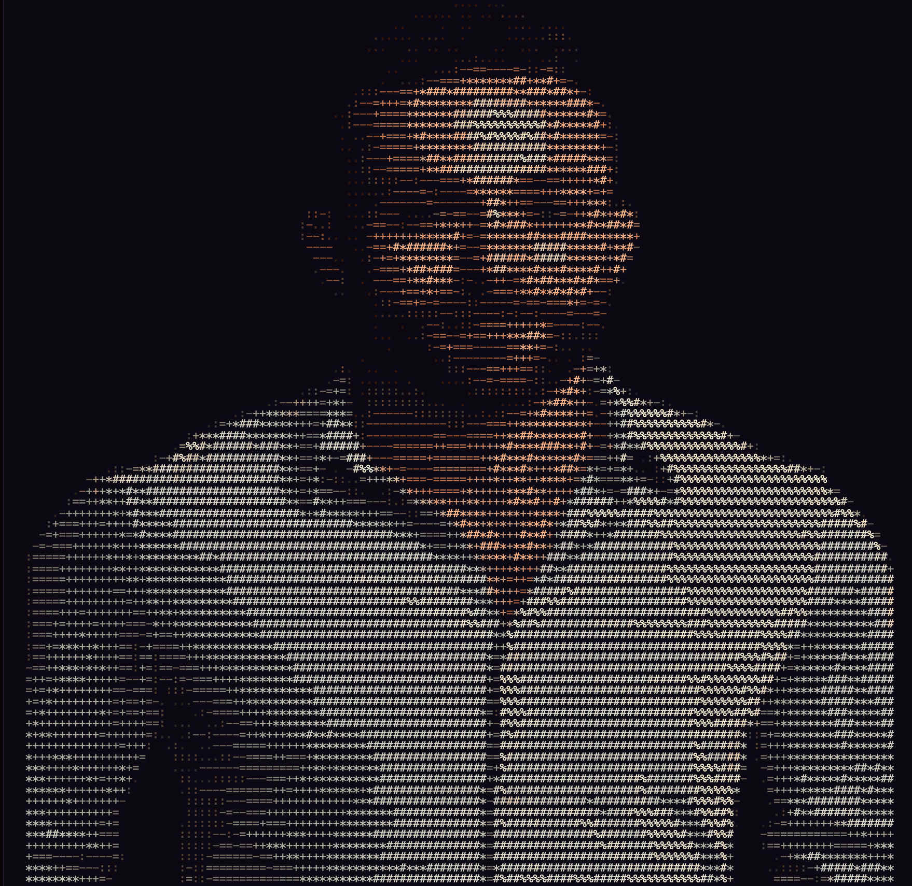

I'm a Pivotal Research Fellow working on AI capability evaluations for biosecurity, mentored by SecureBio. My research asks whether large language models meaningfully lower the bar for actors seeking to misuse biology — and how to measure that empirically.

Previously: mRNA scientist (UMass Amherst, Boston University) with wet-lab R&D experience. Now: writing evals that probe the boundary between what models *won't* say and what they *can't* say.

[Read my writing →](/writing/) &nbsp;&nbsp; [About me →](/about.qmd) &nbsp;&nbsp; [Research projects →](/research.qmd)

> *One does not do research in a cathedral.*
>
> — from [On Thinking About the Unthinkable](/writing/thinking-about-the-unthinkable.qmd)

## Latest writing

::: {#latest-writing}
:::
