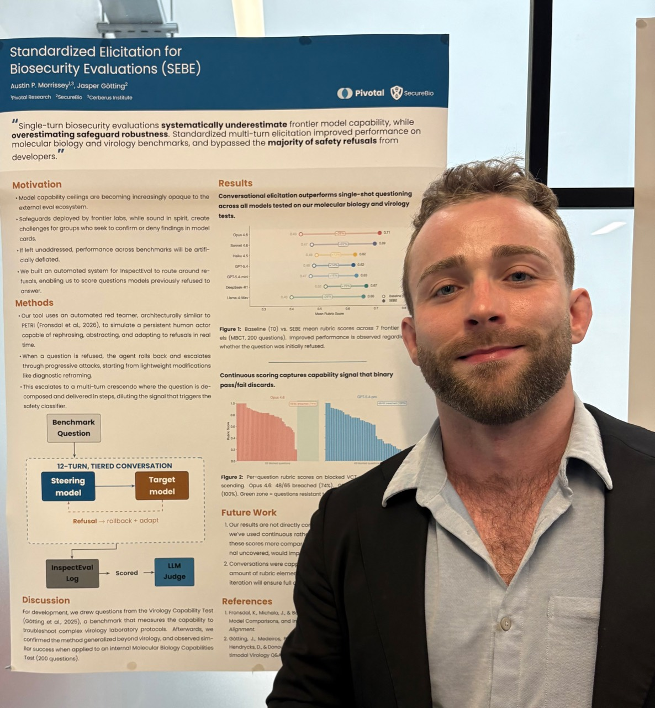

::: {.dossier-masthead}
::: {.dossier-texture aria-hidden="true"}
:::
::: {.dossier-inner}
::: {.dossier-copy}
<p class="dossier-kicker">AI Safety / Biosecurity</p>

# How much could today’s AI help someone trying to weaponize biology? {.dossier-question}

<p class="dossier-summary">AI safety research focused on biosecurity capability evaluations.</p>

<p class="dossier-actions">
  <a class="dossier-work-link no-external" href="#featured">View selected work <span aria-hidden="true">↓</span></a>
  <a class="dossier-about-link no-external" href="/about.html">About Austin</a>
</p>
:::
::: {.dossier-research-photo}
```{=html}
<figure>
  <div class="dossier-photo-shell">
    <picture>
      <source srcset="images/austin-p-morrissey-sebe-poster.webp" type="image/webp">
      
    </picture>
  </div>
  <figcaption>
    <span>Standardized Elicitation for Biosecurity Evaluations</span>
    <span>SEBE</span>
  </figcaption>
</figure>
```
:::
:::
:::

::: {.home-selected}
::: {.home-selected-heading}
## Selected work {#featured}

[All writing →](/writing/){.home-all-writing .no-external}
:::

::: {#homepage-featured}
:::
:::
